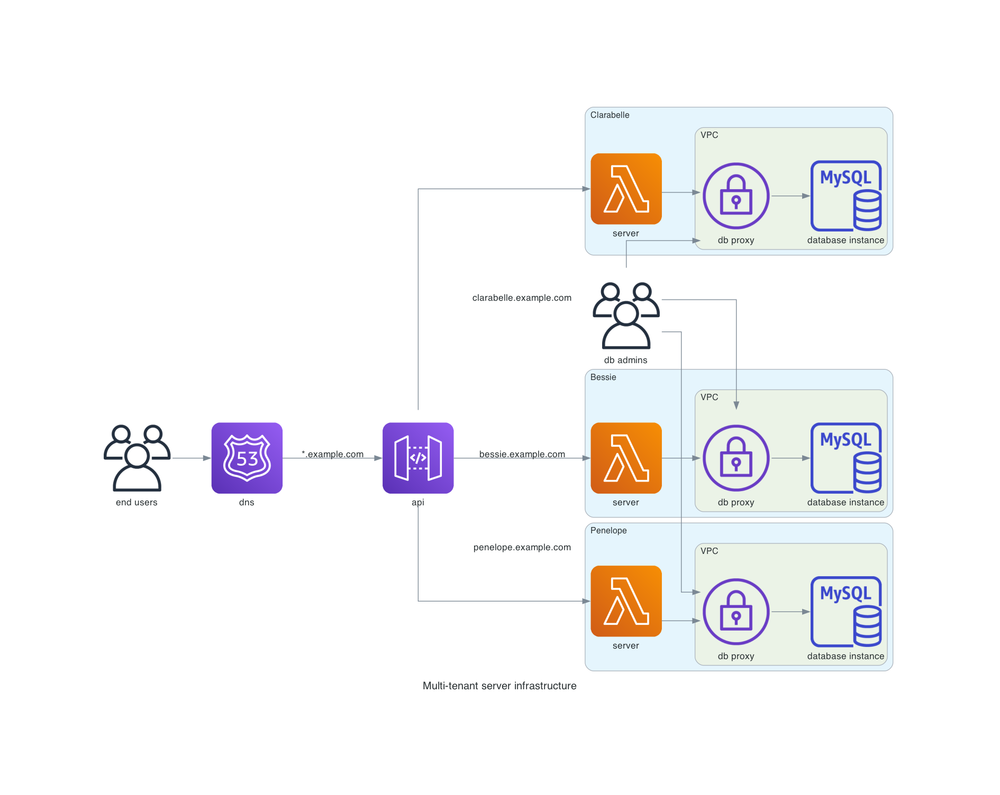

# Multi-tenant AWS infrastructure
An implementation for a small exercise on Terraform and AWS.

## Infrastructure architecture

## Implementation to dos
Due to time constraints there is some work left for a working solution.

- Database proxy resources, ideally with inbound network limitation to the lambda function and a VPN office IP for the database admins if possible. Maybe the different approach with a Lambda VPC integration would be more secure because the is the possiblity to have more fine-grained route control. But there are more "strings to connect" as downside.
- Route53 configuration with a subdomain per tenant and it's API gateway integration. Due to a lack of willingness to spend money on a real domain, this could not be tested.

## Multi-tenancy resource decision
AWS resource type | Benefits | Risks
---|---|---
route 53 | cost reduction and most likely not feasible to have multiple instances for a single domain | single point of failure
api gateway | cost reduction, all configuration in one place | single point of failure
lambda | independent runtime/deployments, easier for the software architecture, just one database connection eliminates risks of leaking foreign data | increased costs and monitoring efforts
database | best separation of tenant data, independent of noisy neigbours | increased costs and monitoring efforts

## Questions on requirements
- What kind of application will be hosted? Web App, mobile App backend, somehing completely different?
- Which tech stack uses the server? Is Dockerization suitable?
- Is scaling an issue? How many users are expected and how computation intense is the application?
- How is the data structured and how is it accessed? Is it more relational and OLTP or OLAP? Or could something else (Key value, Document, ...) be an option?
